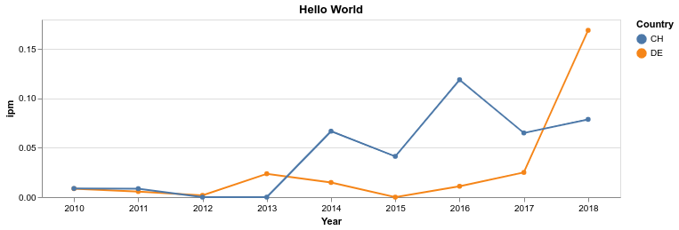

# KorAP web service client package for Python

[](https://www.repostatus.org/#active)
[](https://github.com/KorAP/PythonKorAPClient/actions?workflow=PythonKorAPClient%20CI%20unit%20test)
[](https://github.com/KorAP/PythonKorAPClient/issues)
[](https://github.com/KorAP/PythonKorAPClient/issues)
[](https://github.com/KorAP/PythonKorAPClient/issues)
[](https://github.com/KorAP/PythonKorAPClient/blob/master/LICENSE)


## Description
Python client wrapper package to access the [web service API](https://github.com/KorAP/Kustvakt/wiki) of the [KorAP Corpus Analysis Platform](https://korap.ids-mannheim.de/) developed at [IDS Mannheim](http://www.ids-mannheim.de/).
Currently, this is no native Python package. Internally, it uses [KorAP's client package for R](http://github.com/KorAP/RKorAPClient)
via [rpy2](https://rpy2.github.io/). The latter also automatically translates between R data frames (or [tibbles](https://tibble.tidyverse.org/)) and [pandas DataFrames](https://pandas.pydata.org/docs/reference/api/pandas.DataFrame.html). 

## Installation
#### 1. Install R (version >= 3.5)
From [CRAN](https://cran.r-project.org/bin/) or, alternatively, on some recent Linux distributions: 

```shell script
#### Debian / Ubuntu
sudo apt-get install -y r-base r-base-dev r-cran-tidyverse r-cran-r.utils r-cran-pixmap r-cran-webshot r-cran-ade4 r-cran-segmented r-cran-purrr r-cran-dygraphs r-cran-cvst r-cran-quantmod r-cran-graphlayouts r-cran-rappdirs r-cran-ggdendro r-cran-seqinr r-cran-heatmaply r-cran-igraph r-cran-plotly libcurl4-gnutls-dev libssl-dev libfontconfig1-dev libsecret-1-dev libxml2-dev libsodium-dev python3-pip python3-rpy2 python3-pandas

#### Fedora / CentOS / RHEL
sudo yum install -y R R-devel libcurl-devel openssl-devel libxml2-devel libsodium-devel python3-pandas
```
#### 2. Windows only: Point environment variables to your R installation, e.g.:
```
set R_HOME="C:Program Files\R\R-4.1.1"
set R_USER=%R_HOME%
set PATH=%R_HOME%\bin;%R_HOME%\bin\x64;%PATH%
```

#### 3. Install the R package
```
Rscript -e "install.packages('RKorAPClient', repos='https://cloud.r-project.org/')"
```
#### 4. Install the Python package
```
python3 -m pip install KorAPClient
```
## Documentation
The core classes and methods to access the KorAP API are documented in the [KorAPClient API documentation](https://korap.github.io/PythonKorAPClient/doc/KorAPClient/).
For additional, mostly static helper functions, please refer to the [Reference Manual of RKorAPClient](https://cran.r-project.org/web/packages/RKorAPClient/RKorAPClient.pdf) for now. 
For translating R syntax to Python and vice versa, refer to the [rpy2 Documentation](https://rpy2.github.io/doc/latest/html/index.html).

Please note that some arguments in the original RKorAPClient functions use characters that are not allowed in Python keyword argument names.
For these cases, you can however use Python's `**kwargs` syntax.
For example, to get the result of `corpusStats` as a `pandas.DataFrame`, and print the size of the whole corpus in tokens, you can write:
```python
from KorAPClient import KorAPConnection
kcon = KorAPConnection(verbose=True)
print(kcon.corpusStats(**{"as.df": True})['tokens'][0])
```

## Examples
#### Frequencies of "Hello World" over years and countries
```python
from KorAPClient import KorAPClient, KorAPConnection
import plotly.express as px

QUERY = "Hello World"
YEARS = range(2010, 2019)
COUNTRIES = ["DE", "CH"]

kcon = KorAPConnection(verbose=True)

vcs = [f"textType=/Zeit.*/ & pubPlaceKey={c} & pubDate in {y}" for c in COUNTRIES for y in YEARS]
df = KorAPClient.ipm(kcon.frequencyQuery(QUERY, vcs))

df['Year'] = [y for c in COUNTRIES for y in YEARS]
df['Country'] = [c for c in COUNTRIES for y in YEARS]
df['error_y'] = df["conf.high"] - df["ipm"]
df['error_y_minus'] = df["ipm"] - df["conf.low"]

fig = px.line(df, title=QUERY, x="Year", y="ipm", color="Country",
              error_y="error_y", error_y_minus="error_y_minus")
fig.show()
```


### Identify *in … setzen* light verb constructions by the `collocationAnalysis` method
[](https://www.tidyverse.org/lifecycle/#experimental)
```python
from KorAPClient import KorAPConnection

kcon = KorAPConnection(verbose=True)
results = kcon.collocationAnalysis("focus(in [tt/p=NN] {[tt/l=setzen]})",
                                   leftContextSize=1,
                                   rightContextSize=0,
                                   exactFrequencies=False,
                                   searchHitsSampleLimit=1000,
                                   topCollocatesLimit=20)
results['collocate'] = "[" + results['collocate'] +"](" + results['webUIRequestUrl'] +")"
print(results[['collocate', 'logDice', 'pmi', 'll']].head(10).round(2).to_markdown(floatfmt=".2f"))
```
|    | collocate                                                                                                                                                  |   logDice |   pmi |        ll |
|---:|:-----------------------------------------------------------------------------------------------------------------------------------------------------------|----------:|------:|----------:|
|  1 | [Szene](https://korap.ids-mannheim.de/?q=Szene%20focus%28in%20%5btt%2fp%3dNN%5d%20%7b%5btt%2fl%3dsetzen%5d%7d%29&ql=poliqarp)                              |     10.37 | 11.54 | 824928.58 |
|  2 | [Gang](https://korap.ids-mannheim.de/?q=Gang%20focus%28in%20%5btt%2fp%3dNN%5d%20%7b%5btt%2fl%3dsetzen%5d%7d%29&ql=poliqarp)                                |      9.65 | 10.99 | 366993.93 |
|  3 | [Verbindung](https://korap.ids-mannheim.de/?q=Verbindung%20focus%28in%20%5btt%2fp%3dNN%5d%20%7b%5btt%2fl%3dsetzen%5d%7d%29&ql=poliqarp)                    |      9.20 | 10.34 | 347644.75 |
|  4 | [Kenntnis](https://korap.ids-mannheim.de/?q=Kenntnis%20focus%28in%20%5btt%2fp%3dNN%5d%20%7b%5btt%2fl%3dsetzen%5d%7d%29&ql=poliqarp)                        |      9.15 | 10.67 | 206902.89 |
|  5 | [Bewegung](https://korap.ids-mannheim.de/?q=Bewegung%20focus%28in%20%5btt%2fp%3dNN%5d%20%7b%5btt%2fl%3dsetzen%5d%7d%29&ql=poliqarp)                        |      8.80 |  9.91 | 264577.07 |
|  6 | [Brand](https://korap.ids-mannheim.de/?q=Brand%20focus%28in%20%5btt%2fp%3dNN%5d%20%7b%5btt%2fl%3dsetzen%5d%7d%29&ql=poliqarp)                              |      8.76 |  9.97 | 210654.43 |
|  7 | [Anführungszeichen](https://korap.ids-mannheim.de/?q=Anf%c3%bchrungszeichen%20focus%28in%20%5btt%2fp%3dNN%5d%20%7b%5btt%2fl%3dsetzen%5d%7d%29&ql=poliqarp) |      8.06 | 12.52 |  54148.31 |
|  8 | [Kraft](https://korap.ids-mannheim.de/?q=Kraft%20focus%28in%20%5btt%2fp%3dNN%5d%20%7b%5btt%2fl%3dsetzen%5d%7d%29&ql=poliqarp)                              |      7.94 |  8.91 | 189399.70 |
|  9 | [Beziehung](https://korap.ids-mannheim.de/?q=Beziehung%20focus%28in%20%5btt%2fp%3dNN%5d%20%7b%5btt%2fl%3dsetzen%5d%7d%29&ql=poliqarp)                      |      6.92 |  8.29 |  37723.54 |
| 10 | [Relation](https://korap.ids-mannheim.de/?q=Relation%20focus%28in%20%5btt%2fp%3dNN%5d%20%7b%5btt%2fl%3dsetzen%5d%7d%29&ql=poliqarp)                        |      6.64 | 10.24 |  17105.84 |

## Command Line Invocation
The Python KorAP client can also be called from the command line and shell scripts:
```shell script
$ korapclient -h
usage: python -m KorAPClient [-h] [-v] [-l QUERY_LANGUAGE] [-u API_URL] [-c VC [VC ...]] [-q QUERY [QUERY ...]]

Send a query to the KorAP API and print results as tsv.

optional arguments:
  -h, --help            show this help message and exit
  -v, --verbose
  -l QUERY_LANGUAGE, --query-language QUERY_LANGUAGE
  -u API_URL, --api-url API_URL
                        Specify this to access a corpus other that DeReKo.
  -c VC [VC ...], --vc VC [VC ...]
                        virtual corpus definition[s]
  -q QUERY [QUERY ...], --query QUERY [QUERY ...]
                        If not specified only the size of the virtual corpus will be queried.

example:
  python -m KorAPClient -v --query "Hello World" "Hallo Welt" --vc "pubDate in 2017" "pubDate in 2018" "pubDate in 2019"
```

### Accessed API Services
By using the KorAPClient you agree to the respective terms of use of the accessed KorAP API services which will be printed upon opening a connection.

## Development and License

**Author**: [Marc Kupietz](http://www1.ids-mannheim.de/zfo/personal/kupietz/)

Copyright (c) 2021, [Leibniz Institute for the German Language](http://www.ids-mannheim.de/), Mannheim, Germany

This package is developed as part of the [KorAP](http://korap.ids-mannheim.de/)
Corpus Analysis Platform at the Leibniz Institute for German Language
([IDS](http://www.ids-mannheim.de/)).

It is published under the [BSD-2 License](LICENSE.txt).

**To cite this work, …**<br>
please refer to: Kupietz et al. (2020), below.
## Contributions

Contributions are very welcome!

Your contributions should ideally be committed via our [Gerrit server](https://korap.ids-mannheim.de/gerrit/)
to facilitate reviewing (see [Gerrit Code Review - A Quick Introduction](https://korap.ids-mannheim.de/gerrit/Documentation/intro-quick.html)
if you are not familiar with Gerrit). However, we are also happy to accept comments and pull requests
via GitHub.

Please note that unless you explicitly state otherwise any
contribution intentionally submitted for inclusion into this software shall –
as this software itself – be under the [BSD-2 License](LICENSE.txt).

## References

- Kupietz, Marc / Margaretha, Eliza / Diewald, Nils / Lüngen, Harald / Fankhauser, Peter (2019): [What’s New in EuReCo? Interoperability, Comparable Corpora, Licensing](https://nbn-resolving.org/urn:nbn:de:bsz:mh39-90261). In: Bański, Piotr/Barbaresi, Adrien/Biber, Hanno/Breiteneder, Evelyn/Clematide, Simon/Kupietz, Marc/Lüngen, Harald/Iliadi, Caroline (eds.): [*Proceedings of the International Corpus Linguistics Conference 2019 Workshop "Challenges in the Management of Large Corpora (CMLC-7)"*](https://ids-pub.bsz-bw.de/solrsearch/index/search/searchtype/collection/id/21038), 22nd of July Mannheim: Leibniz-Institut für Deutsche Sprache, 33-39.

- Kupietz, Marc / Diewald, Nils / Margaretha, Eliza (2020): [RKorAPClient: An R package for accessing the German Reference Corpus DeReKo via KorAP](http://www.lrec-conf.org/proceedings/lrec2020/pdf/2020.lrec-1.867.pdf). In: Calzolari, Nicoletta, Frédéric Béchet, Philippe Blache, Khalid Choukri, Christopher Cieri,  Thierry Declerck, Sara Goggi, Hitoshi Isahara, Bente Maegaard, Joseph Mariani, Hélène Mazo, Asuncion Moreno, Jan Odijk, Stelios Piperidis (eds.): [Proceedings of The 12th Language Resources and Evaluation Conference (LREC 2020)](http://www.lrec-conf.org/proceedings/lrec2020/LREC-2020.pdf). Marseille: European Language Resources Association (ELRA), 7017-7023.

